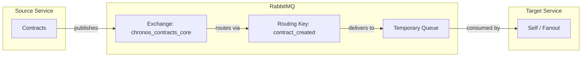

# ContractCreated Event

## Event Flow



## Configuration

| Property | Value |
|----------|-------|
| Exchange | `chronos_contracts_core` |
| Routing Key | `contract_created` |
| Queue | Temporary (auto-generated) |
| Pattern | Fanout (IsTemporary: true) |

## Event Payload

```csharp
public sealed record ContractCreated(
    Ulid ContractId,
    string CompanyName,
    DateOnly AssignmentDate,
    DateOnly? ClosingDate) : IMessage;
```

| Field | Type | Description |
|-------|------|-------------|
| ContractId | Ulid | Unique identifier of the created contract |
| CompanyName | string | Name of the company |
| AssignmentDate | DateOnly | Contract assignment date |
| ClosingDate | DateOnly? | Optional contract closing date (null if active) |
