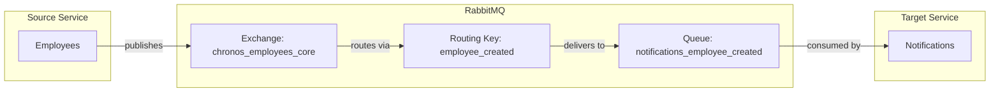

# EmployeeCreated Event

## Event Flow



## Configuration

| Property | Value |
|----------|-------|
| Exchange | `chronos_employees_core` |
| Routing Key | `employee_created` |
| Queue | `notifications_employee_created` |
| Pattern | Fanout (IsTemporary: true) for publisher, Durable for consumer |

## Event Payload

```csharp
public sealed record EmployeeCreated(
    Ulid Id,
    string FirstName,
    string LastName,
    string Email,
    Ulid? SupervisorId) : IMessage;
```

| Field | Type | Description |
|-------|------|-------------|
| Id | Ulid | Unique identifier of the created employee |
| FirstName | string | Employee's first name |
| LastName | string | Employee's last name |
| Email | string | Employee's email address |
| SupervisorId | Ulid? | Optional supervisor identifier |
