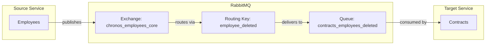

# EmployeeDeleted Event

## Event Flow



## Configuration

| Property | Value |
|----------|-------|
| Exchange | `chronos_employees_core` |
| Routing Key | `employee_deleted` |
| Queue | `contracts_employees_deleted` |
| Pattern | Fanout (IsTemporary: true) for publisher, Durable for consumer |

## Event Payload

```csharp
public sealed record EmployeeDeleted(Ulid Id) : IMessage;
```

| Field | Type | Description |
|-------|------|-------------|
| Id | Ulid | Unique identifier of the deleted employee |

## Consumer Behavior

When consumed by the Contracts service, it removes the deleted employee from all contracts they were assigned to.
