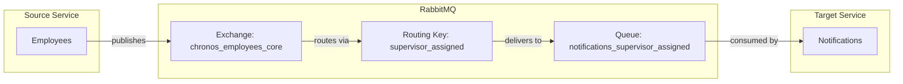

# SupervisorAssigned Event

## Event Flow



## Configuration

| Property | Value |
|----------|-------|
| Exchange | `chronos_employees_core` |
| Routing Key | `supervisor_assigned` |
| Queue | `notifications_supervisor_assigned` |
| Pattern | Durable (IsTemporary: false) |

## Event Payload

```csharp
public sealed record SupervisorAssigned(
    Ulid EmployeeId,
    Ulid SupervisorId) : IMessage;
```

| Field | Type | Description |
|-------|------|-------------|
| EmployeeId | Ulid | Unique identifier of the employee |
| SupervisorId | Ulid | Unique identifier of the assigned supervisor |
