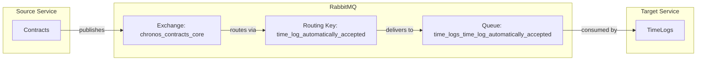

# TimeLogAutomaticallyAccepted Event

## Event Flow



## Configuration

| Property | Value |
|----------|-------|
| Exchange | `chronos_contracts_core` |
| Routing Key | `time_log_automatically_accepted` |
| Queue | `time_logs_time_log_automatically_accepted` |
| Pattern | Durable (IsTemporary: false) |

## Event Payload

```csharp
public sealed record TimeLogAutomaticallyAccepted(
    TimeLogId TimeLogId) : IMessage;
```

| Field | Type | Description |
|-------|------|-------------|
| TimeLogId | TimeLogId | Strongly-typed identifier of the accepted time log |

## Consumer Behavior

The TimeLogs service transitions the time log from `WaitingForAcceptation` state to `Accepted` state, recording the acceptance timestamp and acceptor (supervisor).
