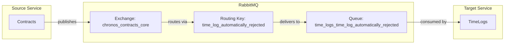

# TimeLogAutomaticallyRejected Event

## Event Flow



## Configuration

| Property | Value |
|----------|-------|
| Exchange | `chronos_contracts_core` |
| Routing Key | `time_log_automatically_rejected` |
| Queue | `time_logs_time_log_automatically_rejected` (expected) |
| Pattern | Durable (expected IsTemporary: false) |

**Note:** This event is published by the Contracts service but no consumer route is currently configured in appsettings.json.

## Event Payload

```csharp
public sealed record TimeLogAutomaticallyRejected(
    TimeLogId TimeLogId) : IMessage;
```

| Field | Type | Description |
|-------|------|-------------|
| TimeLogId | TimeLogId | Strongly-typed identifier of the rejected time log |

## Rejection Reasons

This event is published when:
1. Contract does not exist
2. Employee is not assigned to the contract
3. Total hours after the log would exceed allocated hours
