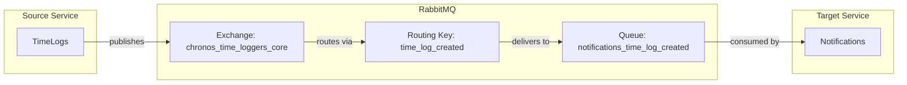

# TimeLogCreated Event

## Event Flow



## Configuration

| Property | Value |
|----------|-------|
| Exchange | `chronos_time_loggers_core` |
| Routing Key | `time_log_created` |
| Queue | `notifications_time_log_created` |
| Pattern | Durable (IsTemporary: false) |

**Note:** This event is configured as a consumer in Notifications but no publisher route is visible in TimeLogs appsettings.json.

## Event Payload (Consumer Side)

```csharp
public sealed record TimeLogCreated(
    Ulid Id,
    TimeSpan TimeSpan,
    Ulid EmployeeId,
    string Topic,
    string? Notes);
```

| Field | Type | Description |
|-------|------|-------------|
| Id | Ulid | Unique identifier of the time log |
| TimeSpan | TimeSpan | Amount of time logged |
| EmployeeId | Ulid | Employee who logged the time |
| Topic | string | Topic/description of the work |
| Notes | string? | Optional additional notes |
