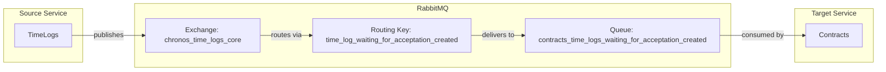

# TimeLogWaitingForAcceptationCreated Event

## Event Flow



## Configuration

| Property | Value |
|----------|-------|
| Exchange | `chronos_time_logs_core` |
| Routing Key | `time_log_waiting_for_acceptation_created` |
| Queue | `contracts_time_logs_waiting_for_acceptation_created` |
| Pattern | Durable (IsTemporary: false) |

## Event Payload

```csharp
public sealed record TimeLogWaitingForAcceptationCreated(
    Ulid TimeLogId,
    Ulid ContractId,
    Ulid EmployeeId,
    TimeSpan Time,
    string Topic,
    string? Notes,
    Ulid SupervisorId,
    TimeSpan TotalAcceptedTimeInMonth) : IMessage;
```

| Field | Type | Description |
|-------|------|-------------|
| TimeLogId | Ulid | Unique identifier of the time log |
| ContractId | Ulid | Contract the time is logged against |
| EmployeeId | Ulid | Employee who logged the time |
| Time | TimeSpan | Amount of time logged |
| Topic | string | Topic/description of the work |
| Notes | string? | Optional additional notes |
| SupervisorId | Ulid | Supervisor who needs to approve |
| TotalAcceptedTimeInMonth | TimeSpan | Total accepted time for this contract in the current month |

## Consumer Behavior

The Contracts service validates:
1. Contract exists
2. Employee is assigned to the contract
3. Total hours after this log do not exceed allocated hours

Based on validation, it publishes either:
- `TimeLogAutomaticallyAccepted` - if validation passes
- `TimeLogAutomaticallyRejected` - if validation fails
